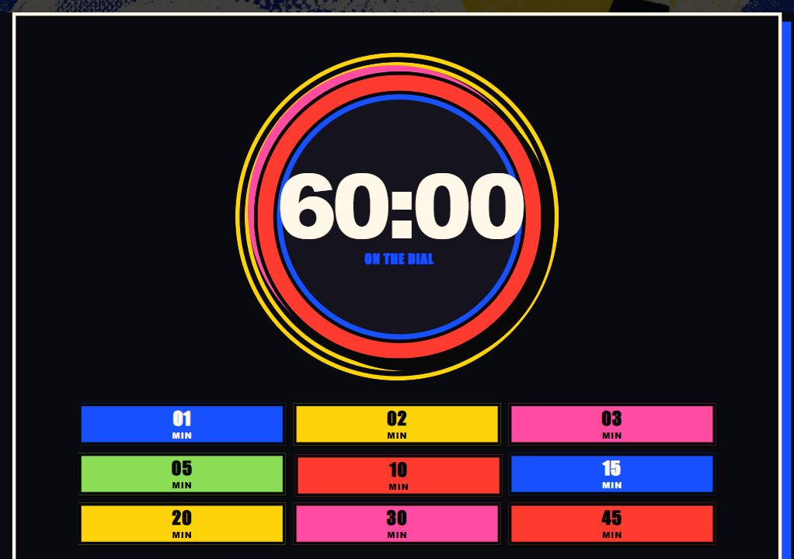
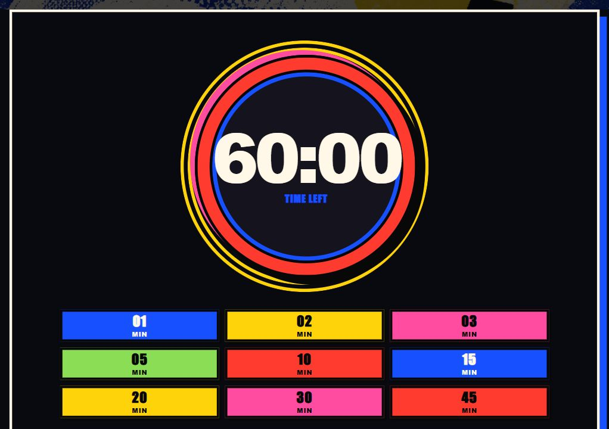
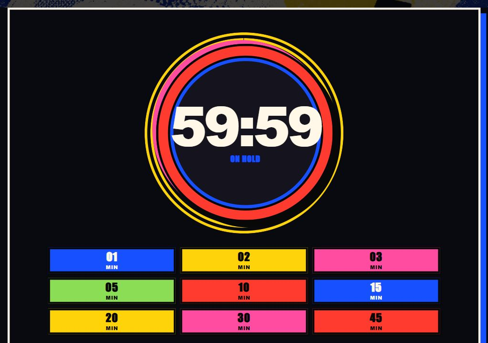

# Ovo Timer

An original, cross-platform countdown timer that recreates the simple, direct
gesture of the classic Android Ovo timer: choose a duration around the dial,
release, and let the countdown run. This implementation is intentionally
independent: it includes no original Ovo source code or proprietary artwork
and is not affiliated with Ilumbo.

## Screenshots

  
  
  

<em>Idle · Running · Paused</em>

## What it does

- Set a countdown from 10 seconds to 60 minutes by dragging the visible
  colored progress band around the clock.
- Follow a two-lap duration trace around the dial: 30 minutes fills the first
  orbit, 60 minutes fills both, and the trace empties with the remaining time.
- Tap the inner clock face to start or pause. Releasing a progress-band drag
  starts the newly selected countdown; Space pauses/resumes and R resets.
- Choose 1, 2, 3, 5, 10, 15, 20, 30, or 45-minute presets from a compact
  three-by-three shortcut grid.
- Receive a 5+ second audible finish alarm. Android also schedules a native
  full-screen alarm that can wake the display while the app is backgrounded
  or the screen is locked. It loops alarm-volume sound and vibration until you
  press `STOP ALARM` (allow Android's requested alarm access when prompted).
- Run the exact same responsive, dark-only experience on Windows and Android.

## Build

1. Install Node.js 20+ and run `npm install`.
2. Run `npm run check` for the unit and syntax checks.
3. Run `npm run build:windows` to create Windows installer and portable EXEs.
4. Run `npm run android:add` once, then configure Android Studio / SDK.
5. Run `npm run android:icons` and `npm run android:apk` to create the debug
   APK.

The Windows output is written under `release/windows/`. Android's debug APK is
written under `android/app/build/outputs/apk/debug/`.

## Design

The production artwork in `assets/` was generated specifically for this
project. The application uses a colorful neo-brutalist print system: hard
black outlines, offset shadows, vivid flat colors, and screenprint texture.
